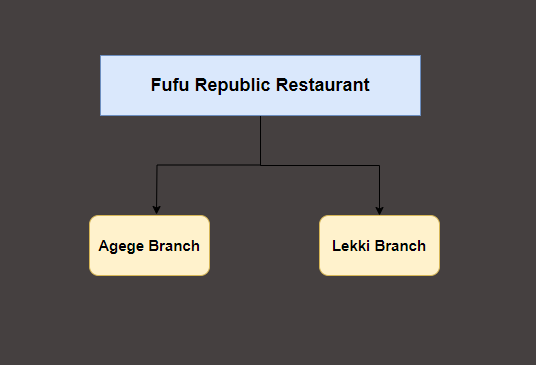
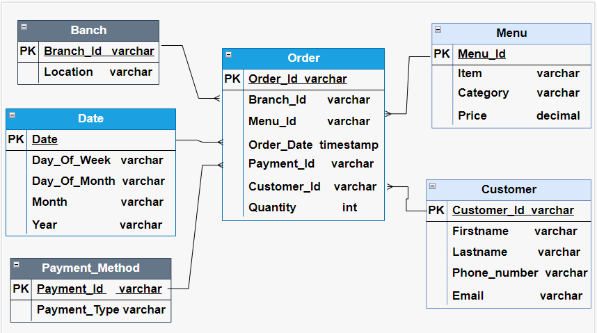

### Case Study: Fufu Republic Restaurant

### Project Description:
Fufu Republic is a popular restaurant chain in Nigeria with multiple outlets nationwide. While the
core menu is standardized, some items vary by location (e.g., the Agege branch may sell
Chinese Rice, while the Lekki branch might not). Customers can order online through the
website or visit outlets for dine-in or take-out.
Payment Methods:
The restaurant accepts:
- Cash
- Debit card payments via Nomba POS terminals at outlets
- Online payments processed through gateways like Nomba Web Checkout, Paystack,
Interswitch etc.

### Challenges:
1. **Inventory Management**:
Variations in customer demand and menu items across branches make it challenging to
maintain optimal stock levels.
2. **Customer Experience**:
The restaurant aims to improve the customer experience by offering personalized
promotions based on purchasing behavior.

### Objective:
Fufu Republic wants to leverage data to:
- Understand sales trends across locations, payment methods, and dining options
(dine-in, take-out, online).
- Manage stock levels efficiently, reducing waste and ensuring availability.
- Enhance customer experience by analyzing purchasing habits and tailoring promotions
accordingly.

As a recently hired data engineer at Fufu Republic, you have been tasked with developing a dimensional model to address the business's needs for data-driven decision-making.
1. Map out the necessary entities ,relationships and constraints: This should be a
model (Any degree of abstraction is okay)
2. Create a dimensional model:
○ Identify a business process of your choice
○ List the business question under the business process you selected
○ Identify the grain, dimensions and fact.

## Solution

**Fufu Republic Branch Outlets**

-----------------------

## Entities
- Order: Order Request made by customers.(dine-in, take-out, online)
- Customer: The customer who made the request
- Branch: The restaurant branch where the order was made
- Menu: The food items in the restaurants'
- Payment_Method: The mode of payment used by the customer to make payment
- Date: The date the order was made

------------------------------------

### Business Process
- Customers' Order

### Business Question
- What is the total quantity demanded
- What is the profit generated
- What is the most used payment method
- What is the customers' favorite dish
- Which order type was most utilized by customers

### Dimension
- Customer
- Branch
- Payment_Method
- Date
- Menu

### Fact
- Order

## Data Modelling

