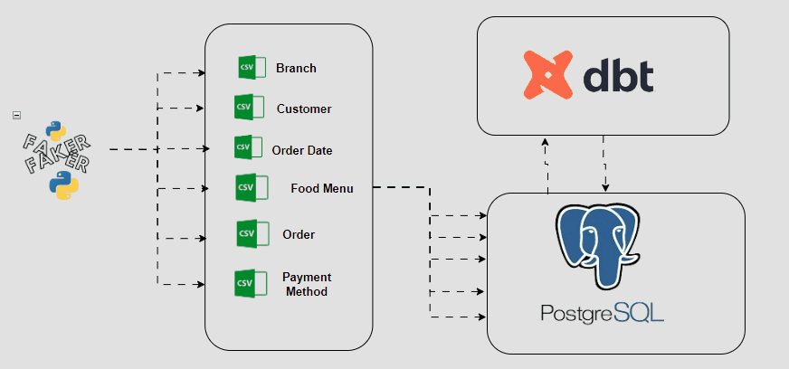

## Fufu Republic: Data Loading and Transformation Using DBT

### This task is based on [SQL](https://github.com/ioaviator/CDE_Bootcamp/tree/sql) data modelling task.

This task requires the usage of DBT to perform data loading into a data warehouse and performing transformation

## Tools Used
- Python
- Faker Library
- DBT
- PostgreSQL

### Pipeline Architecture
--------------------------


<br>

## Usage

- Clone repository 
  ```
  git clone repo-url
  cd cloned_repo
  ```

- Checkout dbt branch
  ```
  git checkout dbt
  ```

- Set up virtual environment and activate
  ```
  python -m venv venv
  
  source venv/Scripts/activate
  
  or

  source venv/bin/activate
  ```
- Install required package dependencies
  ```
  pip install -r requirements.txt
  ```

- Run `python generate_data.py`
- Change directory into fufu_republic_dbt  
  ```
  cd fufu_republic_dbt
  ```
- Create a profiles.yml file for data warehouse credentials. see `example_profiles.yml`. Add your credentials depending on your data warehouse of choice
- Run `dbt seed` to populate the data warehouse with generated data
- Run `dbt run` to apply the generated data models into the data warehouse 
- Open your data warehouse to verify data is properly loaded