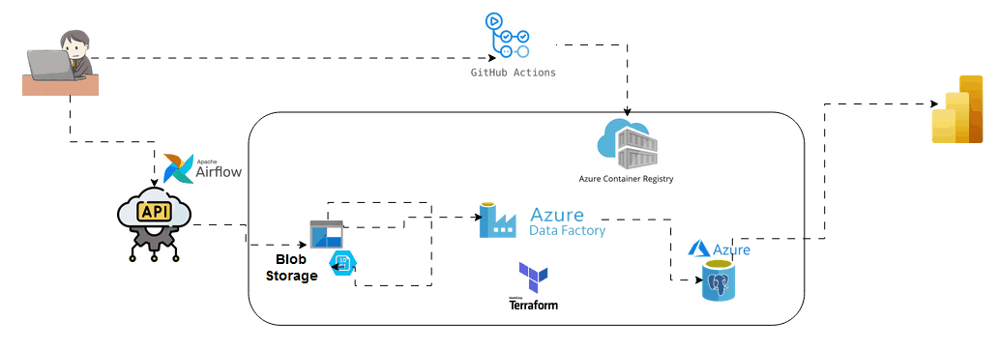

## Work in progress

## Backgroud Story

A travel Agency whose business model involves recommending tourist location to their customers based on different data points reached out to Core Data Engineers CEO.
They want one of Core Data Engineers graduates to build a Data Platform that will process the data from the [Country rest API](https://restcountries.com/v3.1/all) into their (travel agency) cloud based Database/Data Warehouse for predictive analytics which will be used by their Data Science team

## Project Setup

This guide gives instructions on how to setup the project environment and provision necessary configurations

## Requirements
- Python 3.10 + higher
- Azure Cloud [Storage Account, PostgreSQL, Container Registry, Data Factory]
- Astronomer Airflow
- Terraform
- DBT
- Docker Desktop
- Microsoft Power BI
- Github Actions

## Usage

## Clone the repository

```bash
# clone the project repository
git clone https://github.com/ioaviator/CDE_Bootcamp

# Navigate to the cloned repository
cd https://github.com/ioaviator/CDE_Bootcamp
```

```bash
# Create virtual environment for local development/testing
python -m venv venv 

# Activate venv environment
source venv/Scripts/activate

#Install dependencies
pip install -r requirements.txt
```

## Create secret credentials
```bash
# In the project root directory, create a .env file and load these variables

ACCOUNT_KEY="key-to-azure-cloud-storage-account"
URL="url-to-parquet-file-stored-in-cloud-storage"
```

# Provision Cloud Infrastructure with Terraform
```bash
    # Login into Azure
    az login
```
# Get subscription ID from Azure portal
From the home portal, search for Subscriptions in the search box.
Click on the current subscription name, copy the subscription id

```bash
# Navigate into the terraform folder
# Create a file name credentials.txt
# Add this file inside the .gitignore file. Do not!! version control this file

# Click on the provider.tf file and reference the credentials.txt file

provider "azurerm" {
  features {}

subscription_id = file("credentials.txt")
}
```

```bash
    # Provision all services needed for project
    # Inside the terraform directory
    # initiliaze  
    terraform init

    # plan
    terraform plan

    # Format the code 
    terraform fmt

    # apply to provision resources
    terraform apply --auto-approve
```

Get the Azure cloud storage connection string and account key
```bash
# Account Key
az storage account keys list -g MyResourceGroup -n MyStorageAccount

# Connection String
az storage account show-connection-string -g MyResourceGroup -n MyStorageAccount
```

Inside the project root directory, create a `.env` file.

Set up the Connection String and Account URL
```bash
CONN_STRING="DefaultEndpointsProtocol=https;AccountName=cdede;AccountKey=3Q5Y8yrMw==;EndpointSuffix=core.windows.net"
ACCOUNT_KEY="3Q5Y8yrS2/jcs8NDGuYZOLmjTr"

```
## Set up Data Transformation with DBT

```bash
# Navigate into dags/dbt/dbt_pipeline directory

cd dags/dbt/dbt_pipeline

# Initilaize the project with dbt init. 

dbt init

# Select and configure dbt database credentials. 
# This project uses dbt-postgres. Make sure to have a running instance of postgresql, on prem or on Azure Cloud. This project makes use of Azure Cloud

# Running the dbt init command will create a .dbt/profiles.yml file inside your computer user directory 

# Example: C:\Users\Username\.dbt

# Copy the contents of .dbt/profiles.yml file. Create a file named profiles.yml inside the dbt_pipeline folder and paste the copied contents

# The profiles.yml file contains secret credentials. Make sure the profiles.yml file is included inside .gitignore

```
### Test database connection with DBT debug 
```bash
# RUN dbt debug to make sure your connection to on-prem Postgres or Azure postgresql service is successful

dbt debug
```

### Start the apache airflow services
```bash
    # Navigate into the root of the project directory
    cd CDE_Bootcamp

    # Initialize the airflow astro project
    astro dev init

    # start the astro webserver
    astro dev start
    # This command boots up the services needed to start up the project
```



## Work in progress, 